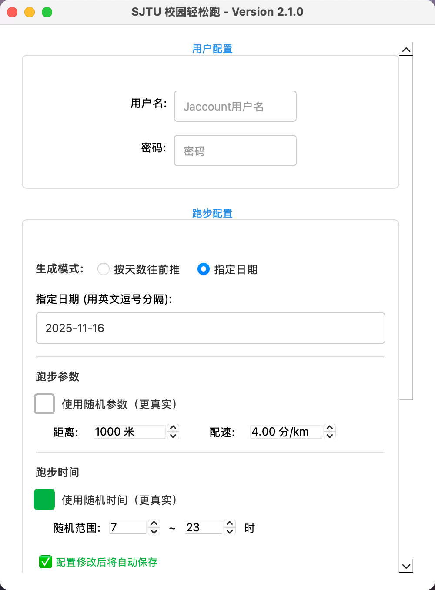

# 🏃 SJTU Running

> 上海交通大学校园跑步自动化工具 —— 一键登录、轨迹生成、批量上传

<p align="center">
  
</p>

---

## ✨ 功能亮点

| 功能 | 描述 |
|------|------|
| 🔐 **自动登录** | 支持 Jaccount 登录，自动识别验证码 |
| 📍 **轨迹生成** | 基于真实校园路线生成 GPS 轨迹 |
| 📅 **批量上传** | 支持多日记录一键上传 |
| 🎲 **随机参数** | 支持随机距离、配速、时间，更自然 |
| 🖥️ **图形界面** | 简洁直观的 GUI，无需命令行操作 |
| 💻 **多平台支持** | 适配 Windows 和 macOS 系统 |
---

## 🚀 快速开始

### 1️⃣ 安装依赖

```bash
pip install PySide6 requests tenacity
```

### 2️⃣ 启动程序

```bash
python qtui.py
```

### 3️⃣ 使用流程

1. **输入账号密码** — 填写 Jaccount 用户名和密码
2. **配置参数** — 设置日期、距离、配速等参数（**配置自动保存**）
3. **开始上传** — 点击"一键跑步"，等待完成

> 💡 **提示**: 账号密码仅用于登录，不会保存到配置文件

---

## ⚙️ 参数配置

工具支持两种模式配置日期和跑步参数：

### 📅 日期设置

| 模式 | 说明 | 适用场景 |
|------|------|----------|
| **指定日期模式** | 手动选择具体日期 | 补录特定日期的跑步记录 |
| **天数模式** | 从今天往前推 N 天 | 批量补录最近几天记录 |

### 🏃 跑步参数

| 参数 | 固定模式 | 随机模式 |
|------|----------|----------|
| **距离** | 使用 `每日距离_米` | 在 `距离最小_米` ~ `距离最大_米` 之间随机 |
| **配速** | 使用 `配速_分钟每公里` | 在 `配速最小_分钟每公里` ~ `配速最大_分钟每公里` 之间随机 |
| **时间** | 使用 `固定跑步时间_时/分` | 在 `随机时间范围_开始时` ~ `随机时间范围_结束时` 之间随机 |

### 📄 配置文件示例 (`config.json`)

```json
{
    "指定日期模式": true,
    "指定日期列表": ["2025-01-15", "2025-01-16"],
    "跑步天数": 7,
    "参数随机": true,
    "每日距离_米": 3000,
    "配速_分钟每公里": 5.0,
    "距离最小_米": 2500,
    "距离最大_米": 4000,
    "配速最小_分钟每公里": 4.5,
    "配速最大_分钟每公里": 6.5,
    "GPS采样间隔_秒": 3,
    "跑步时间随机": true,
    "固定跑步时间_时": 8,
    "固定跑步时间_分": 0,
    "随机时间范围_开始时": 7,
    "随机时间范围_结束时": 20,
    "起点纬度": 31.031599,
    "起点经度": 121.442938,
    "终点纬度": 31.0264,
    "终点经度": 121.4551
}
```

---

## 📁 项目结构

```
SJTURunning/
├── qtui.py              # 🖥️ GUI 主程序入口
├── config.json          # ⚙️ 配置文件
├── src/
│   ├── main.py          # 核心业务逻辑
│   ├── login.py         # Jaccount 登录模块
│   ├── api_client.py    # API 请求封装
│   ├── data_generator.py# GPS 轨迹生成
│   └── config.py        # 配置加载模块
├── utils/               # 工具函数
└── assets/              # 资源文件（图片等）
```

---

## ⚠️ 注意事项

| 类型 | 说明 |
|------|------|
| 🚫 **配速限制** | 服务器配速校验范围通常为 3-9 分钟/公里 |
| 📆 **日期限制** | 不要提交未来日期的记录 |
| ⏱️ **频率限制** | 避免短时间内多次提交，建议间隔操作 |

---

## 🔒 安全与隐私

- ✅ 账号密码仅用于获取登录凭证，**不会保存**
- ⚡ 验证码识别使用 `https://geek.sjtu.edu.cn/captcha-solver/`
- 🔧 如需更高隐私性，可自行替换验证码识别服务

---

## ❓ 常见问题

<details>
<summary><b>登录失败怎么办？</b></summary>

- 检查账号密码是否正确
- 确认网络连接正常
- 验证码识别服务可能暂时不可用，稍后重试
</details>

<details>
<summary><b>上传失败怎么办？</b></summary>

- 检查网络连接
- 可能是服务端限制，稍后重试
- 检查参数是否在合理范围内（如配速、距离）
</details>

<details>
<summary><b>如何设置起点和终点？</b></summary>

配置文件中的 `起点纬度/经度` 和 `终点纬度/经度` 定义了跑步轨迹的起终点坐标。默认设置为闵行校区内的位置。
</details>

<details>
<summary><b>为什么没有按照我填写的参数生成轨迹？</b></summary>

- 配置会在修改后自动保存，请确认参数已正确填写
- 可自行查看`config.json`文件中的参数是否正确更新
</details>

---

## 📜 免责声明

本工具仅供学习与研究使用，请遵守学校相关规定。使用本工具产生的一切后果由使用者自行承担。

---

<p align="center">
  <b>版本 2.1.0</b> · Made with ❤️ for SJTUer
</p>
